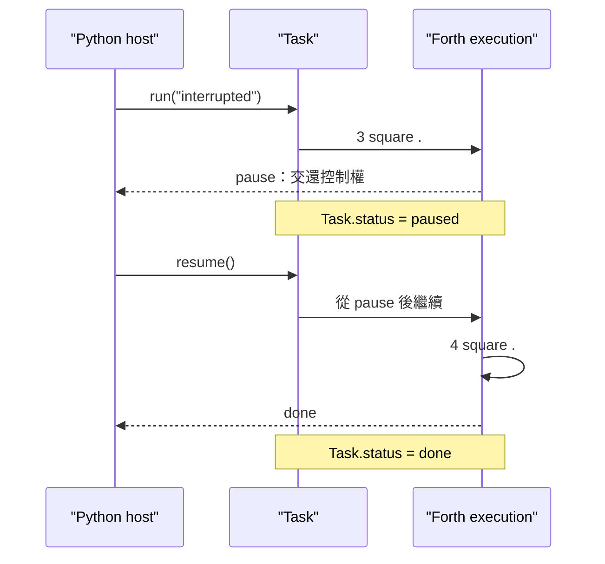
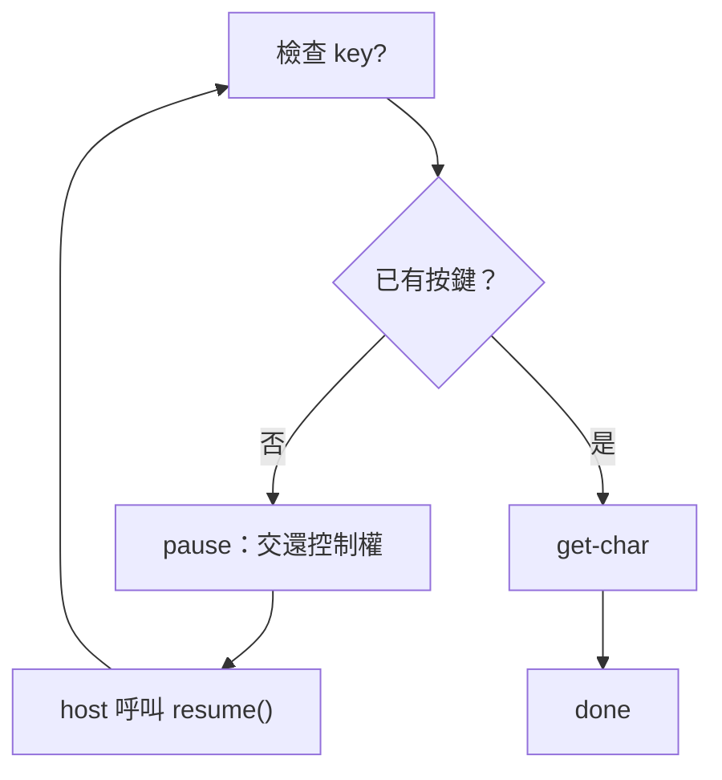
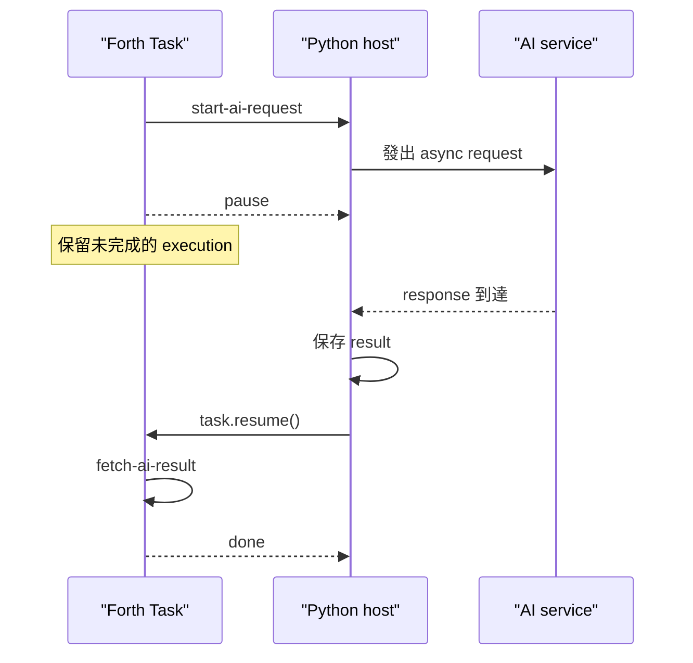
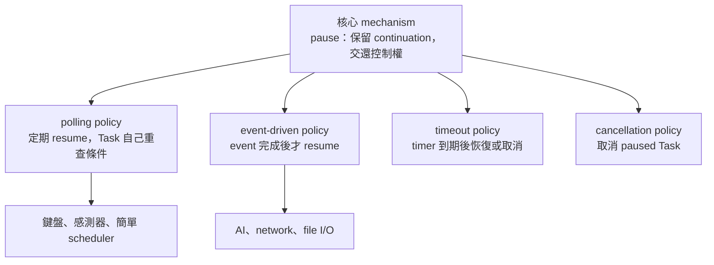

# 一聲 `pause`，把未完成的未來交回 host

## —— Project K 的 Continuation 與 cooperative multitasking

Project K 是一個極小的 Forth kernel。它不把所有功能預先塞進核心，而是從少數能力開始，讓使用者逐步定義出自己的 words、語法與工具。

在目前的 Python 實作中，kernel 最初只有 `code` 與 `end-code`；`pause` 是建立在其上的一個小小 extension：

```forth
code pause
    yield vm.pause()
end-code
```

它沒有參數，也沒有把資料放上 stack。它只做一件事：

> 暫停目前這條執行路徑，將控制權交回 Python host；host 日後呼叫 `task.resume()` 時，同一條路徑便從原處繼續。

這三行看似平淡，卻足以讓 Project K 用同一種基本動作處理鍵盤輸入、AI response、network I/O、timer，或任何「現在還不能往下做」的工作。

先把一句最重要的話放在前面：

> `pause` 不是重新開始，也不是把整台 VM 存成快照；它是保留尚未完成的執行路徑，暫時把控制權交還給 host。

---

## 1. 先看一個完整的小例子

假設 extension layer 已經提供 `:`、`;`、`square` 與 `.`，我們可以定義：

```forth
: interrupted
    3 square .
    pause
    4 square .
;
```

Python host 這樣執行：

```python
task = machine.run("interrupted")
print(task.status)       # paused

task.resume()
print(task.status)       # done
```

第一次 `run()` 的輸出是：

```text
9
```

程式在 `pause` 處讓出控制權，host 拿到狀態為 `paused` 的 Task。之後 host 呼叫 `resume()`，程式不會重新計算 `3 square`；它從 `pause` 之後繼續，輸出：

```text
16
```



「從 `pause` 後繼續」正是整個設計的中心。

---

## 2. Continuation 是什麼？

Continuation 可以先用一句白話來記：

> Continuation 是程式此刻還沒走完的那一段未來。

它很像遊戲的即時存檔，但這個比喻不能用得太滿。遊戲存檔常會把整個世界複製成一份檔案；Project K 的 `pause` 不會複製整台 VM，也不會把 data stack 包成每個 Task 私有的快照。

目前實作真正保留的是：

- Python generator 停在 `yield`；
- generator 裡的 local variables 還活著；
- 尚未返回的呼叫鏈還活著；
- 已組合的 Forth words 走到哪一步，也由這條 generator chain 保留。

Task 持有最外層 generator，因此持有這段尚未完成的 execution。

反過來說，VM 的 data stack、word definitions 與 host resources 仍然放在原本的 VM。它們不是 Task 專屬的冷凍庫。

所以，比起「把整個宇宙拍成照片」，更準確的畫面是：

> 舞台沒有拆，演員也沒有離場；只是大幕暫時落下，所有人維持走位，等下一次開幕。

### 在 Project K 裡，訊號如何傳出去？

這條路徑很直接：

1. Forth word 執行 `yield vm.pause()`。
2. `VM.call()` 用 `yield from` 承接這個 generator。
3. `VM.evaluate()` 再把暫停訊號向外傳。
4. `Task.resume()` 收到 Project K 專用的 pause signal。
5. Task 轉為 `paused`，控制權回到 host。
6. host 下一次呼叫 `resume()`，同一條 generator chain 從 `yield` 後面接著走。

因此，`resume()` 不是再次呼叫原本的 word；它是在推動同一個尚未結束的 generator。

---

## 3. 等鍵盤：polling 與「無知的巡邏警衛」

以下是概念性的 Forth。它使用 `begin/while/repeat`、`key?`、`get-char` 等高階 words；這些不是 Project K 初始 kernel 的一部分，而是可以在 kernel 上逐步長出來的 extension。

```forth
: key ( -- char )
    begin
        key? 0=
    while
        pause
    repeat
    get-char
;
```

它做的事很單純：

1. 用 `key?` 檢查鍵盤 buffer。
2. 若尚未有字元，執行 `pause`，不占住 CPU。
3. host 稍後恢復 Task。
4. Task 從 `pause` 後面走到 `repeat`，回去重新檢查。
5. 有字元時離開迴圈，再用 `get-char` 取出它。



host 完全可以像一名無知但盡責的巡邏警衛：

```python
for task in tasks:
    if task.status == "paused":
        task.resume()
```

它不需要知道某個 Task 在等鍵盤、在等網路，還是在等烤箱預熱。Task 被叫醒後自己重查條件；若條件還沒好，就再一次 `pause`。

這是 polling：host 定期提供「你可以往前試一步」的機會，而 Task 自己判斷此刻能不能真的往下走。

這種無知帶來漂亮的 separation of concerns：等待條件留在 Forth 工作裡，host 只負責調度。

不過巡邏也不能太熱心。若 host 無限制地高速呼叫 `resume()`，polling 仍會浪費 CPU。因此真正的 scheduler 通常需要合適的 interval、sleep 或 backoff。警衛可以無知，不能亢奮。

---

## 4. 等 AI：event-driven 的震動號碼牌

如果等待的是幾秒鐘才回來的 AI response，未必需要一次又一次地 polling。可以使用 event-driven 的策略：

```forth
: call-ai ( prompt -- response )
    start-ai-request
    pause
    fetch-ai-result
;
```

這段程式正確的前提是：

> host 只能在 AI request 已完成、結果已可取得時，才呼叫 `task.resume()`。

它像咖啡廳的震動號碼牌：

- `start-ai-request` 發出 request；
- Task 執行 `pause`，交還控制權；
- host 保留 Task reference，並把它與這次 request 的完成事件關聯起來；
- AI response 到達後，host 先保存結果，再呼叫 `task.resume()`；
- `fetch-ai-result` 這時才讀取結果。



這種情況只需要一次 `pause`，因為 callback 本身就是「咖啡已經煮好」的保證。

但如果 host 仍用每 5 毫秒巡邏一次的 polling，這段程式就不安全：Task 可能在 AI 還沒回覆時，就直接執行 `fetch-ai-result`。

此時有兩種正確策略：

- **polling**：Forth 用迴圈反覆檢查 `ai-ready?`；尚未完成就再次 `pause`。
- **event-driven**：host 只在 completion callback 發生後才 `resume()`。

所以，`pause` 本身既不是 polling，也不是 event-driven。它只提供一次「交棒」；何時把棒子交回來，是 host 的 policy。

---

## 5. mechanism 與 policy 的分離

Project K 的重點不在於讓 `pause` 知道所有事情，而在於讓它只知道自己的事情。



`pause` 不必知道：

- 在等什麼；
- 要等多久；
- 誰來恢復它；
- 恢復時是帶著 result、timeout 還是 cancellation。

這些屬於 policy；`pause` 提供的是 mechanism。

把 policy 移出小小的 kernel，不等於 policy 從世界上消失。host 仍要管理 event、timer、Task lifetime 與 error handling。Project K 的克制在於：不是每一個等待都必須背著同一套龐大 API。

---

## 6. Task ID、timeout、Cancellation Token、Lock：究竟少了什麼？

### 6.1 Task ID：可以沒有號碼，但不能沒有 identity

Project K 不要求數字型 `task_id`。host 可以直接保有 Task object：

```python
task = machine.run("interrupted")
task.resume()
```

這避免了「ID → Task」的額外查表。但 host 若管理多個 Task，仍須保存每一個 Task reference；event-driven 時，也仍須知道哪一個 event 要恢復哪一個 Task。

> 可以不用 Task ID；不能沒有 Task identity。

### 6.2 timeout：不寫進 `pause`，不表示時間不存在

`pause` 沒有 timeout parameter，因此保持單純。timeout 可以由 host 的 timer，或 Forth extension 自己的時間檢查來處理。

這是 responsibility separation，不是把時間從宇宙中刪掉。host 若要管理數千個 deadline，仍要有可靠的 timer 與 scheduler；只是那套機制不必塞進每一個 `pause`。

### 6.3 cancellation：paused Task 容易取消，running Task 仍要合作

目前實作可以取消 `ready` 或 `paused` 的 Task：

```python
task.cancel()
```

它會關閉 suspended generator，將 Task 設成 `aborted`。已經發生的 side effect 不會自動 rollback。

但若 Task 正在 `running`，外部不能在同一個 thread 裡突然闖進去把它切斷；目前實作會拒絕這種 `cancel()`。若一段純計算長時間都不 `pause`，它仍會占住控制權。

這時需要：

- 在合適的 safe point 主動 `pause` 或檢查中止條件；
- 從正在執行的 word 呼叫 `vm.abort()`；
- 或把工作放到 process、thread 等更強的隔離環境。

另外，「把 Task object 丟掉，GC 自然會處理」不是可靠的 cancellation protocol。scheduler 或 callback 可能還保有 reference，GC 何時執行也不保證。要取消，就明確呼叫 `task.cancel()`。

### 6.4 Lock：VM 內不必用 mutex，但邊界仍要守

在 single-threaded 的 cooperative multitasking 中，每一瞬間只有一個 Task 正在執行；切換只發生在它主動 `pause` 的地方。因此，Project K kernel 不需要在每一個 stack operation 前後加 mutex，也不會有 preemptive multithreading 那種 data race。

但這句話有清楚的邊界：

- 目前 VM 明確不是 thread-safe；其他 thread 若同時碰它，仍須 serialization 或 lock。
- 外部 library 若自行建立 thread，仍受該 library 的同步規則約束。
- 沒有 data race，不代表沒有 logical interference。

最後一點最值得小心。

---

## 7. 多個 Task 共用同一個 VM，會不會踩到彼此？

會，如果設計不守紀律。

目前多個 Task 可以共享同一個 VM，也就共享同一個 data stack 與 word definitions。假設 Task A 把半成品留在 stack 上便 `pause`，Task B 接著改動同一個 stack；A 被恢復時，眼前的 TOS 可能早已不是它以為的東西。

這不是 data race，因為 A 與 B 沒有同時執行；但它確實是 logical interference。

因此，cooperative multitasking 仍需要清楚的 discipline：

- 不要跨過 `pause`，還依賴脆弱的共享 stack layout；
- 等待中的資料放在 generator 的 local variables，或明確的 request object；
- 不同工作使用不同 VM；
- 或由 extension layer 建立 task-local stack／context。

同樣地，cooperative multitasking 不保證 fairness。某個 word 若長時間計算卻不 `pause`，其他 Task 仍然只能在門外等。

> `pause` 減少了 preemptive multithreading 的一大類複雜度；它沒有取消 shared state、lifetime 與 fairness 的設計責任。

知道這個邊界，不會削弱 `pause`；反而讓我們知道它最適合在哪裡發揮。

---

## 8. `pause` 不做的事

下表把責任分界說清楚：

| `pause` 不負責 | 真正負責者 |
| --- | --- |
| 發出 AI 或 network request | Forth word 或 host adapter |
| 判斷鍵盤是否已有輸入 | `key?` 一類 extension word |
| 決定何時恢復 Task | host scheduler 或 event callback |
| 保存 AI result | host 或明確的 request object |
| 處理 timeout | host timer 或 extension layer |
| 取消長時間 running 的程式 | safe point、`vm.abort()` 或更強隔離 |
| 隔離不同 Task 的資料 | VM 或 extension layer 的 state design |
| 提供 fairness | scheduler policy |
| 讓 VM 自動 thread-safe | 沒有；目前 VM 不是 thread-safe |

`pause` 真正承諾的只有：

> 當 execution 到達這裡時，將一個可繼續的 Task 交回 host；下一次恢復同一個 Task，execution 從這個讓出點之後接續。

這個承諾不大，卻剛好大到足以建造很多東西。

---

## 9. 為什麼這三行仍然迷人？

因為它把「怎麼停下來」與「為什麼停、何時再動」切得很乾淨。

- Forth 工作最了解自己在等什麼。
- host 最了解鍵盤、network、AI SDK、event loop 與 timer。
- `pause` 只負責兩者之間的一次交棒。

沒有萬用 parameter list，也沒有把所有將來的需求預埋進 kernel。polling 與 event-driven 使用同一個 word；差異只在 resume policy，不在 pause mechanism。

這正是 Project K 的精神：

> 核心提供生長的能力；系統的豐富性由後續定義逐步長出來。

---

## 結語：不是魔法，而是一個剛剛好的接縫

`pause` 看起來神祕，是因為我們平常只看見程式「開始」與「結束」，很少看見一段尚未完成的 execution，被完整地交回 host。

它不是整台 VM 的時空膠囊，不是 async framework 的縮小版，也沒有把 timeout、cancellation、identity 與 shared state 從宇宙中刪除。

它只是借助 Python generator，保留一條活著的 continuation，然後說：

> 「我先把控制權還你。等你認為時機到了，再讓我從這裡往下走。」

它像文章裡的一個逗號：逗號不知道作者為何停筆，也不知道下一句何時到來；它只忠實地保留一句話尚未說完這件事。

Project K 的優雅，不在於聲稱三行程式能解決所有 async 問題，而在於它只承擔自己真正需要承擔的那一小段——不多，也不少。

