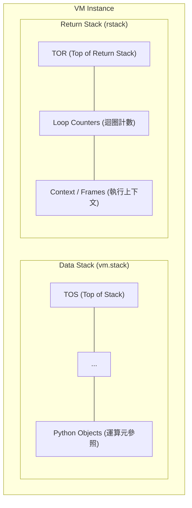
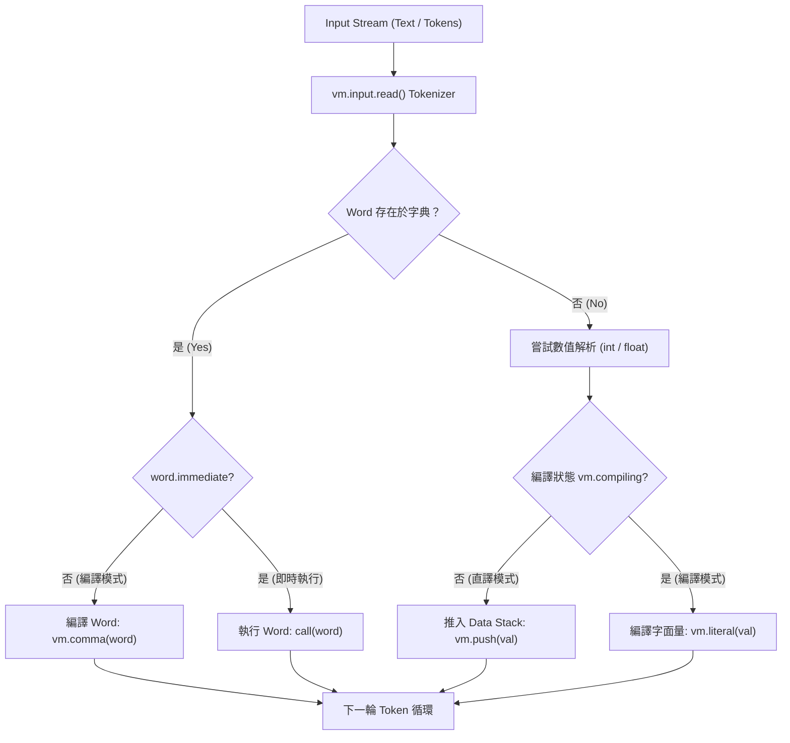
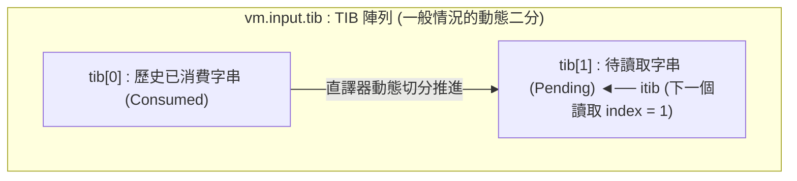
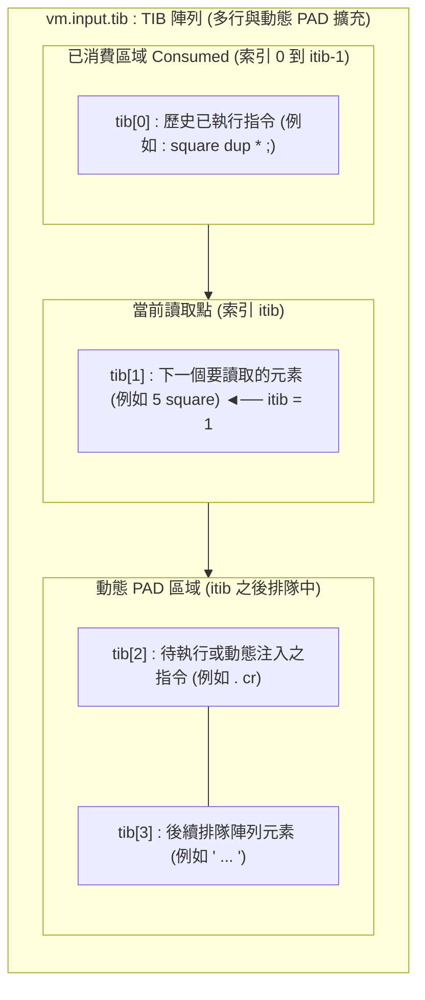
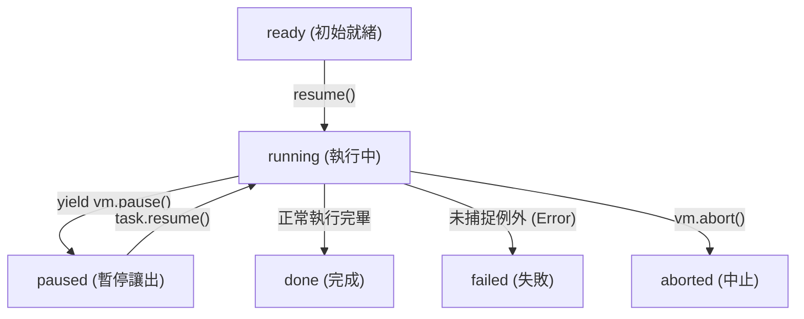

# Project K (Python Edition) 技術手冊與架構設計理念

> **版本**：v2.0 (Python Host Core)  
> **適用環境**：Python 3.10+ / Linux, WSL, Windows  
> **核心代碼**：`projectk.py`, `repl.py`, `base.f`

---

## 序言：重構極簡主義的威力

在電腦科學的演進史中，Forth 代表著一種登峰造極的極簡美學：雙 stack 虛擬機、零語法開銷、純粹的後綴表示法，以及完全開放編譯器內部狀態的 Metaprogramming 威力。然而，傳統 16-bit 與裸機 (Bare-metal) 時代的 Forth 體系，在現代軟體工程中卻逐漸陷入孤島困局——封閉的平坦位元組記憶體空間、薄弱的原生資料結構、缺乏現代型別系統，以及無法直接調用海量第三方軟體庫的窘境。

**Project K (Python Edition)** 的誕生，並非為了在現代作業系統中復刻一套 1980 年代的骨董模擬器，而是為了探索一個全新的架構範式：  
**當 Forth 純粹的雙 stack 拓撲與 Metaprogramming 靈魂，直接寄生於 Python 這種具備豐富物件生態與動態特性的現代 Host Language 之上，會引爆出何等強大的化學反應？**

本手冊是 Project K 的系統架構指南與設計理念記錄。本手冊**不做**傳統 Forth 語法的入門字典（各 Word 本身已內建 `help` 與 `comment` 自我文檔），而是深入剖析 Project K 如何用一個僅數百行程式碼的微核心，在動態物件世界中重建純粹的 Forth 哲學，並徹底解構傳統非同步編程的沉重枷鎖。

> [!TIP]
> **想直接動手跑起來？**  
> 如果您希望立即在終端機操作、執行互動 REPL 或配置全域命令列工具 `f`，請直接參閱專門指南 [`setup.md`](setup.md)（如何執行指南）。  
> 本手冊（Manual）與執行指南（Setup Guide）分開撰寫的根本原因在於：**本手冊記錄的是 Project K 歷久彌新的架構設計理念，而如何執行與環境配置方式則會隨著作業系統、命令列工具或安裝方案的演進而隨時迭代更新**。讀者只需參閱 `setup.md` 前兩三行指令，即可保證在 3 秒內最簡啟動。

---

## 第一章：設計理念與架構概述 (Design Philosophy & Architecture)

### 1.1 傳統 Forth 的困局與 Project K 的解方

傳統 Forth（如 FIG-Forth、Forth-79/83 與 ANS Forth）具備驚人的執行效率與自我延展性，但在現代計算環境中面臨三大根本瓶頸：

1. **Flat Memory 記憶體沙盒的局限**：傳統 Forth 假設全系統運作在一個線性位址空間（通常是 64KB 的 byte array）。這在裸機微控制器上十分自然，但在具備垃圾回收機制 (GC)、高階物件導向與虛擬記憶體的現代 Host 上，強行模擬 flat memory 只是在沙盒裡畫地為牢，無法直接共享 Host 的高階物件。
2. **型別系統與資料結構的匱乏**：傳統 Forth 的 stack 單元本質上只是單純的 cell（整數或指標）。處理多維陣列、雜湊表 (hash map)、多型物件或動態字串時，程式設計師必須從頭用記憶體位移自行實作，代碼難以維護。
3. **生態系割裂**：現代工程的生產力建立在第三方庫（科學計算、機器學習、網路協定、作業系統 API）之上。如果一個語言無法零成本地直接調用這些庫，就只能淪為玩具。

**Project K 的核心破局之道：共生微核心 (Symbiotic Micro-Kernel)**
* **拋棄沙盒，共享物件空間**：Project K 的 stack 上流轉的不再是單純的 16-bit/32-bit 位元組，而是**活生生的 Python 物件參照**（整數、浮點數、字串、清單、字典、生成器乃至自訂 class 實例）。
* **機制在 Forth，能力在 Host**：Forth 保留其無可匹敵的流程中樞控制力、自訂 DSL 能耐與 Metaprogramming factory；而重型運算、系統 API、字元編碼與巨量庫則直接由 Python 全權支撐。

---

### 1.2 雙 Stack 虛擬機架構 (Dual-Stack VM)

Project K 恪守經典 Forth 的雙 stack 虛擬機核心幾何：



1. **Data Stack (`vm.stack`)**：
   * 運算元的流通中心與參數傳遞管線。
   * 物理實作為 Python 原生 `list`。所有的推入 (`push`) 與彈出 (`pop`) 均受到邊界保護；當 stack 為空而嘗試 pop 時，由 Python 層級直接拋出明確的 `ForthError("Data stack is empty")`，杜絕記憶體隨機損毀。
2. **Return Stack (`rstack`)**：
   * 用於計數迴圈計數器暫存（如 `for ... next`）、執行上下文保護以及程式流程的臨時中轉（`>r`, `r>`）。
   * 雙 stack 的徹底解耦，使得運算資料與控制流程互不干擾，維持清晰的結構對稱性。

#### Stack Effect 標記慣例
在無型別語法的後綴世界中，Stack Effect 註釋是理解程式不變式的命脈。Project K 採用標準雙 stack 註釋慣例：
```forth
\ 單純操縱 Data stack
( a b -- c )

\ 跨越 Data stack 與 Return stack
( x -- ) ( R: -- x )

\ 整合式標記
( n1 n2 -- n3 | R: count -- count-1 )
```
* `--` 左側代表執行前的 stack 狀態；右側代表執行後的 stack 狀態。
* 頂端元素 (Top of Stack, TOS) 位於最右側。
* 常用約定符號：`n` (整數/數值), `flag` (布林值), `x` (任意物件), `str` (字串), `addr` (清單或索引位址)。

---

### 1.3 核心執行模型與生命週期

Project K 的 Outer Interpreter 擁有極致簡明的狀態循環：



* **直譯模式 (`vm.compiling = False`)**：
  遇到 Word 立即執行；遇到數值立即推入 Data stack。
* **編譯模式 (`vm.compiling = True`)**：
  遇到普通 Word，將其編譯至正在構建的 Word 指令列中 (`vm.comma(word)`)；
  遇到 `immediate` Word（如 `;`, `if`, `s"`），**打斷編譯直接執行該詞**，賦予其在編譯期操縱編譯器行為的 Metaprogramming 能力；
  遇到數值，自動包裝為字面量指令編譯進指令列 (`vm.literal(value)`)。

---

### 1.4 核心組件與工程架構

系統由三個職責高度自治的模組組成：

| 組件檔案 | 定位 | 職責與邊界 |
| :--- | :--- | :--- |
| `projectk.py` | 核心 VM 引擎 | 包含 `Input` 串流解析器、`_Word` 核心結構、`Task` 狀態機、`VM` 容器，以及原生 Python 代碼塊 (`code ... end-code`) 的語彙編譯機制。不預載任何高階 Forth 詞彙，純粹、輕量且原生支援 Coroutines。 |
| `base.f` | Bootstrap 字典 | 以純粹的 Forth 語法撰寫之字典正本（800+ 行）。從 `code immediate` 起步，逐步自舉出控制結構、字串家族、Defining Words、`does>`、三階段 `see` 與 Python Host Bridge。各 Word 透過 `//` 與 `///` 內建完整說明文檔。 |
| `repl.py` | 執行期與 REPL | 負責環境裝配、`readline` 命令歷史、多行貼上跳脫保護 (`bracketed paste`)、`code` 多行緩衝區收集，以及全域 CLI 進入點。 |
| `f.sh` / `f.cmd` | 跨平台啟動器 | 動態解析 `%USERPROFILE%` 與 `PROJECTK_HOME`，支援 Linux/WSL 符號連結穿透與 Windows 一鍵啟動。 |

---

## 第二章：串流解析、語彙分析與界定機制 (Stream Parsing & Lexical Architecture)

### 2.1 輸入串流模型 (Input Stream Architecture)

在 `projectk.py` 中，輸入源被抽象為一個狀態化的消耗型物件 `Input`：

```python
@dataclass
class Input:
    tib: list[str]
    itib: int = 0
```
* `tib`：Terminal Input Buffer，字串陣列（Array of Strings）。
* `itib`：指向 `tib` 陣列中下一個待讀取與解析的元素索引。
* `consume(count)`：從當前活躍緩衝區消費指定數量的字元，並累積記錄至 `tib[0]`。
* `read()`：自動跳過連續的前導空白（空格、Tab、換行），並抓取下一個以空白分隔的單一 token。
* `read(until=delim)`：保留前導內容，連續讀取字元直到遇到指定的定界字串（或編譯好的正則表達式），並消耗定界符。
* `rest()`：一口氣消耗並回傳從當前 itib 到末尾的所有剩餘文字。

#### 註解的即時跳越
藉由 `Input` 的可塑性，註解 Word 均被標記為 `immediate`，在讀取當下即時消耗串流，完全不參與編譯：
* `\ `：單行註解，即時前進游標至下一行的開頭。
* `( ... )`：區塊註解，直接調用 `vm.input.read(until=")")` 吞沒內容。
* `//` 與 `///`：分別將行內說明與詳細多行註解直接附加於 `vm.last().help` 與 `vm.last().comment` 上，使 Word 具備原生自文檔能力。

---

### 2.2 為什麼 Host Tokenizer 能解決邊界模糊問題？

在 Forth 擴充原生代碼時，最危險的陷阱莫過於代碼塊定界符的混淆。在 `code ... end-code` 的設計中，我們必須判定「哪裡是代碼塊的真正終點」。

#### 傳統文字搜尋的致命漏洞
若使用單純的字串搜尋或正則表達式比對 `end-code`：
```python
code sample
    # 警告：這個註解包含 end-code 關鍵字！
    debug_msg = "這是一個字串常數，裡面也有 end-code 標記"
    print(debug_msg)
end-code
```
傳統的正則搜尋在掃描到第一行註解 `# ... end-code` 或字串常數時，就會**誤以為代碼塊已結束**，導致後半段程式碼被丟給 Forth 直譯器執行，瞬間引發不可收拾的語法崩潰！

#### Python 原生語彙分析器的降維打擊
Project K 的破局點在於：**讓 Host 的 Lexer 來審查 Host 的程式碼！**  
在 `VM._find_code_terminator` 中，核心直接引入 Python 標準庫的 `tokenize.generate_tokens`：

```python
for token in tokenize.generate_tokens(io.StringIO(text).readline):
    # 逐一檢視語彙 token
```
因為 `tokenize` 模組是 Python 編譯器本身的語彙前端，它原生就能識別：
* `tokenize.COMMENT`（註解內部文字）
* `tokenize.STRING`（字串常數內部文字）
* `tokenize.NAME` 與 `tokenize.OP`（真正的語法標記）

當且僅當 `end`、`-`、`code` 出現在頂層且非字串、非註解的代碼位置時，Project K 才確認找到真正的定界邊界！**這種直接借力 Host 語彙分析器的架構，徹底杜絕了代碼邊界判定失效的長年痛點。**

---

### 2.3 動態定界符與 Extensible Parsing 機制

在傳統語言中，字串遇到包含雙引號時往往必須寫成繁瑣的跳脫符號（如 `\"` 或 `\'`），這在編寫正則表達式或 JSON 時被稱為「跳脫字元地獄 (Escaping Hell)」。

Project K 在 `base.f` 中透過 Metaprogramming 打造了一整套字串定界符族群：

```forth
: string-quote ( delim <name> -- )
    create , immediate
does> ( -- string )
    @ (s) ;
```

利用這個 factory，系統一氣呵成定義了六種常用字串定界詞：
* `s"`：以 `"` 結尾。
* `s'`：以 `'` 結尾（適合內部包含雙引號的字串）。
* <code>s&grave;</code>：以反引號結尾。
* `s|`：以管線符 `|` 結尾（極度適合包含各種引號的正規表達式或 HTML 標籤）。
* `s^`：以脫字元 `^` 結尾。
* `s/`：以斜線 `/` 結尾（適合路徑字串）。

在直譯模式下，它們直接將字串物件推入 Data stack；在編譯模式下，自動生成字面量指令。這完美展現了「擴充解析器不需要改動編譯器核心，只需用 Forth 定義新 Word」的延展思路。

---

## 第三章：記憶體模型、動態串流與 PAD 架構 (Memory, Streams & The PAD Concept)

### 3.1 告別 Flat Memory：現代物件導向 Data Space

在傳統 Forth 系統中，`here` 是一個指向 RAM 位元組的整數指標，`,` (comma) 是將數值拷貝進實體記憶體。  
在 Project K 裡，這個概念被現代物件模型昇華：

1. **Word 的資料載體是 Python List**：  
   由 `create` 建立的 Word，其內部包含一個專屬的 `body = []` 清單。
2. **`@` (fetch) 與 `!` (store) 的現代多型語義**：
   ```python
   code !
       addr = vm.pop()
       val = vm.pop()
       if isinstance(addr, list):
           if not addr: addr.append(val)
           else: addr[0] = val
       elif isinstance(addr, int):
           if vm.compiling: vm._definition.body[addr] = val
   end-code
   ```
   * 當 `addr` 是一個 Python `list` 時（例如 Word 的 `body`），`!` 與 `@` 直接讀寫該 list 的第一個元素 `addr[0]`！
   * 這使得 `variable` 與自訂結構不需要計算實體位元組偏移量，直接享有 Python 原生垃圾回收機制維護物件生命週期。
   * **非首元素存取與切片 (Indexing & Slicing)**：  
     在傳統 Forth 中，連續存取陣列必須依賴指標算術（如 `addr 1 CELLS + @`）。但在 Project K 中，Word 的 `body` 是真實的 Python `list`，若強行使用數值加法運算（如 `xx 1+ @`）會直接被 Python 攔截型別錯誤。  
     正確且優雅的做法是直接透過 Host Bridge 的 `:>` 享受 Python 原生索引與切片：
     ```forth
     create xx 123 , 456 ,
     xx @ .         \ 輸出: 123 (取出首元素)
     xx :> [1] .    \ 輸出: 456 (直接索引第二項)
     xx :> [1:] @ . \ 輸出: 456 (切片產生子清單後，交由 @ 取出首項)
     ```
     這清晰展示了 Forth stack 資料流與 Python 切片運算式的混血之美。

---

### 3.2 編譯期位址概念與回填

在編譯期，`here` 被賦予了精準的架構意義：
* `here` 推入的是當前正在編譯的定義指令列長度：`len(vm._definition.body)`。
* 當 `,` 於直譯模式執行時，它將值附加到 `vm.last().body`；而於編譯模式執行時，則將指令追加進編譯陣列。
* 當 `!` 的目標是一個整數時，它專門用於**編譯期指令回填 (Backpatching)**，將跳轉目標索引寫入預留的空位。

---

### 3.3 輸入串流作為動態緩衝區與 PAD 的現代詮釋

傳統 Forth 擁有 **TIB (Terminal Input Buffer)** 與 **PAD**（暫存草稿區，通常配置在字典指標 `HERE` 上方幾十位元組處，專供數字格式化運算或字串組裝使用）。而在 TIB 內部，則透過指標 **`itib`（經典 Forth 稱為 `>IN`，在 eForth 與 peforth 系列常稱之為 `iTIB`）** 指向緩衝區中「下一個即將被讀取的字元或項目索引」。

在傳統架構中，PAD 是一塊固定大小的靜態記憶體區塊，既無法動態擴展、容易有記憶體溢位風險，又與直譯器的輸入緩衝區各自為政。

在 Project K 的設計理念中，這個經典架構迎來了本質上的昇華：
1. **`vm.input.tib` 即是現代化的 `TIB` 陣列**（以字串陣列 Array of Strings 為載體，常簡稱為 `tib`）。
2. **`itib` 直接指向 TIB 陣列中下一個要讀取的元素索引 (`tib[itib]`)**。
3. **在 `itib` 後方排隊的陣列元素，正是天然的動態 PAD！**

---

#### 1. 一般情況下的動態二分模型 (The Normal Binary Split)

在正常情況下，使用者輸入（無論是 REPL 單行指令還是程式單次送入的代碼）初始都**只有一個 string**。

然而，當直譯器開始運作、若我們在執行中途「半路進去檢視」時，這個輸入會被直譯器動態切成兩半，也就是**兩個 strings**：

```python
# 例如輸入 ": square dup * ; 5 square ."
# 當直譯器剛完成 square 編譯時，半路檢視 TIB 的內部狀態：
tib[0] = ": square dup * ; "     # 已經被直譯器消費完畢 (Consumed: 定義已編譯)
tib[1] = "5 square . "            # 尚未消費、下一個要讀取的字串 (Pending, itib = 1)
```

1. **`tib[0]`**：已經被語彙分析器讀取並執行的前半段（已 consumed）。
2. **`tib[1]`（即 `tib[itib]`，此時 `itib = 1`）**：尚未被讀取、正等待直譯器推進求值的後半段。



這項動態切分機制確保了直譯器能精確掌握「已走過的歷史」與「當前待解譯的串流」，使語彙狀態一目了然。

---

#### 2. 多行與動態 PAD 擴展情境 (Multi-line & Dynamic PAD)

當輸入跨越多行，或是程式在執行期需要動態生成程式碼、組裝字串（即傳統 Forth 的 PAD 工作）時，`TIB` 陣列便可自然展開為多個元素的陣列：

```python
tib[0] = ": square dup * ; "     # 歷史已執行指令 (Consumed)
tib[1] = "5 square "             # 當前正要讀取執行的指令 (itib = 1)
tib[2] = ". cr "                 # itib 後面排隊中的元素，就是 PAD！
tib[3] = " ... "                 # 後續待執行的陣列元素
```



#### 動態維護的三個維度

在任何時刻，直譯器透過 `itib` 清晰劃分出三個區塊：

1. **已消費區域 (Consumed: `0` 到 `itib - 1`)**：
   歷史上已經被直譯器完成吞吐與求值的指令列（如 `tib[0]` 完成了 `square` 的編譯）。
2. **當前讀取點 (Next Reading Target: `itib`)**：
   直譯器**下一個即將讀取並執行的陣列元素**（如 `tib[1]` 即將執行 `5 square` 並將計算結果推入 stack）。
3. **itib 後面排隊中的元素即是 PAD (Pending / Dynamic PAD: `itib + 1` 之後)**：
   指針後方尚未被讀取的後續陣列元素（如 `tib[2] = ". cr"`）。

---

#### 為什麼「itib 後面就是 PAD」？

這是 Project K 架構設計上的重大創新：**未被消費的排隊空間本身就是最高效的動態草稿區！**

* **自由拿捏與動態注入**：
  直譯器與應用程式可以隨時在 `itib` 之後動態切割、修剪、拼裝或插入新的字串元素。例如程式在執行當前邏輯時，若需要動態產生一段 Forth 指令並交付執行，只需將組裝完成的字串注入到 `tib[itib + 1]`。
* **草稿暫存與程式求值的合一**：
  在傳統 Forth 中，在 PAD 拼裝完文字後，必須耗費心力透過字串搬移拷貝至 TIB 才能交由直譯器執行。而在 Project K 中，直譯器順流前進時，隨著 `itib` 往前推進，原本在 PAD 中排隊或動態拼裝的字串（如 `tib[2] = ". cr"`）自然無縫地成為下一個被讀取求值的指令。
* **徹底免除溢位隱患**：
  陣列的大小與各字串長度均由現代動態語言環境全權管理，完全沒有固定位元組上限的困擾，讓「草稿暫存 (PAD)」與「動態程式碼求值 (Dynamic Evaluation)」在概念與實作上融為一體。

---

## 第四章：流程控制結構的創新實現 (Control Structures: Classical Elegance on Modern VM)

### 4.1 現代結構下的經典優雅

在沒有底層組合語言、沒有平坦機器碼記憶體、指令是一串 Python 物件與 action tuple 的環境下，我們要如何實現經典的 `if else then`、`begin until` 與計數迴圈？

Project K 給出的答案是：**以編譯期 Control Stack 實現典雅的抽象回填。**  
在外表看來，Forth 代碼保持著純粹經典的書寫風格；但在幕後，直譯器精巧地利用 Control Stack（即編譯期的 Data stack）在指令清單的陣列索引上穿針引線。

---

### 4.2 條件分支與 Forward Branch 回填

> [!NOTE]
> 這套典雅的控制結構實作是照抄 FigTaiwan 陳爽（爽哥）的原始 source code。這是源自 Forth 前輩經典的結構設計，在現代 VM 的 Python list 索引結構上，原汁原味重現其優雅！

條件判斷依賴兩個底層基礎運算元：
* `branch`：無條件跳轉，將當前 frame 的 instruction pointer (`vm.frame.ip`) 變更為緊隨其後的單元數值。
* `0branch`：條件跳轉，彈出 TOS，若為 False 則跳轉；若為 True 則跳過目標位址單元繼續執行。

```forth
: if    ['] 0branch , here 0 , ; immediate
: then  here swap ! ; immediate
: else  [compile] ahead swap [compile] then ; immediate
: ahead ['] branch , here 0 , ; immediate
```

#### 執行期骨架剖析
當編譯 `: test if ." YES" else ." NO" then ;` 時：
1. `if` 編譯 `0branch`，並在指令列預留一個空位 `0`，將該空位的索引 `here` 留在 stack 上。
2. 編譯 True 區塊 (`." YES"`）。
3. `else` 編譯 `ahead`（無條件跳轉 `branch`），留下一號空位，並回填先前 `if` 的目標為當前位置。
4. 編譯 False 區塊 (`." NO"`）。
5. `then` 取得一號空位的索引，將當前最新位置 `here` 回填進去！

整個過程在 Python `list` 陣列索引上完成，既無組合語言的複雜性，又完全保留了 Forth 的極簡編譯對稱性。

---

### 4.3 不定次數迴圈體系

1. **`begin ... until` (後測試迴圈)**：
   ```forth
   : begin  here ; immediate
   : until  ['] 0branch , , ; immediate
   ```
   `begin` 在 stack 上留下起點索引；`until` 編譯 `0branch` 並將起點索引寫入，條件為 False 時回跳。
2. **`begin ... again` (無窮迴圈)**：
   直接編譯無條件跳轉 `branch` 回起點。
3. **`begin ... while ... repeat` (前測試迴圈)**：
   ```forth
   : while   [compile] if swap ; immediate
   : repeat  [compile] again [compile] then ; immediate
   ```
   `while` 調用 `if` 留下一處未結算的前向跳轉點；`repeat` 一方面將無條件回跳 `again` 導回起點，另一方面將 `while` 的出口回填至迴圈末端。

---

### 4.4 計數迴圈的精妙結構：`for ... next` 與 `aft`

除了條件迴圈，Project K 還實作了基於 Return stack 的高效計數迴圈：

* `for` `( count -- ) ( R: -- count )`：
  編譯 `>r` 將計數器推入 Return stack，並留下迴圈起點。
* `doNext`：
  執行期將 Return stack 頂端的計數減一；若仍大於 0 則跳回起點，若歸零則彈出計數器並離開。
* `next`：
  編譯 `doNext` 並閉合回跳位址。

#### `for ... aft ... then ... next` 的幾何奇蹟
若需要在迴圈第一輪跳過某些初始化邏輯，傳統語言往往必須設置旗標變數。而在 Forth 經典美學中，`aft` 利用編譯期 stack 的三次位址穿梭完成此一神技：
```forth
: aft  drop [compile] ahead [compile] begin swap ; immediate
```
首輪執行直接越過 `aft ... then` 之間的區塊，從次輪起方才進入循環。這種幾何般的結構美感，在 Project K 現代 VM 上得以 100% 完整重現！

---

## 第五章：字典、編譯器與 Factory 體系 (Dictionary, Compiler & Factory Architecture)

### 5.1 字典模型與 Word 結構

Project K 的字典是由 Word 物件組成的動態集合。每個 Word 均被封裝為 `projectk.py` 中的 `_Word` 資料類別：

```python
@dataclass
class _Word:
    name: str
    action: object
    immediate: bool = False
    source: str = ""
    help: str = ""
    comment: str = ""
    type: str = ""
    _value: object = None
    body: list = None
```

* `name`：Word 在字典中的鍵值（大小寫敏感）。
* `action`：Word 的執行主體。可以是原生 Python 可呼叫物件 (Callable)，也可以是由指令組成的 tuple（Colon 定義）。
* `immediate`：布林旗標，標記該詞是否在編譯狀態下即時執行。
* `source`：儲存原生 Python 代碼字串（針對 `code` 定義）。
* `help` 與 `comment`：分別由 `//` 與 `///` 註解填入的說明文檔。
* `body`：專屬的 Python 清單，用於存放 Word 實例的資料單元。
* `type`：**Word 的身份識別標記**（後述）。

#### 字典查詢與 Introspection
* `'` (tick)：在直譯模式下推入 Word 物件，在編譯模式下將該詞編譯為字面量。
* `[']`：強制作為編譯期字面量。
* `words`：列出字典中所有可用 Word，支援關鍵字過濾。
* `last`：取得最新定義的 Word 參照 (`vm.last()`)。

---

### 5.2 Colon 定義與編譯器控制

冒號定義 (`:`) 是 Forth 擴充詞彙的主要手段。其底層運作如下：
1. `:` 調用 `vm.begin(name)`：
   * 建立一個暫存的 `_Word(name, None)`。
   * 將系統狀態切換至編譯模式 (`vm.compiling = True`)。
   * 初始化編譯清單 `body = []`。
2. 逐一編譯指令：
   * 普通 Word 以 `vm.comma(word)` 追加至 body。
   * 數值以 `vm.literal(val)` 包裝追加。
   * Immediate Word 打斷編譯，即時執行。
   * 若需延遲 Immediate Word 的執行（強制將其編譯為指令），使用 `[compile] <name>`。
3. `;` 調用 `vm.finish()`：
   * 將暫存 body 固化為不可變的元組 `word.action = tuple(body)`。
   * 將新詞安裝進字典 `vm.words[name] = word`。
   * 將系統狀態還原為直譯模式 (`vm.compiling = False`)。

---

### 5.3 Defining Words 與 Custom Factory 機制

在 Forth 哲學中，最崇高的境界不是寫出功能強大的函數，而是寫出**「能製造新 Word 的 Word (Defining Words)」**。在現代架構中，這就是極致的 **Custom Factory 模式**。

Project K 透過 `create` 與 `(does>)` / `does>` 實現了完美的 factory 機制：

```forth
code create
    name = vm.input.read()
    if not name: raise ForthError("create expects a name")
    body = []
    def default_action(v, b=body):
        v.push(b)
    word = vm.define(name, default_action, type="created", body=body)
end-code
```
* **`create` 的 Compile-time**：從輸入串流讀取一個新名字，為其分配專屬的 `body = []`，並預設執行期行為是「將這個 body list 推入 Data stack」。

#### `does>` 的執行期黑魔法
`does>` 的任務是：**截斷 defining word 的後續指令，並將這段指令動態綁定為剛建立的子 Word (child word) 的執行體！**

在 `base.f` 中，`(does>)` 展現了令人驚嘆的動態 Metaprogramming 設計：
```python
code (does>)
    child = vm.last()
    frame = vm.frame
    steps = frame.action[frame.ip:]          # 截取 does> 之後的所有後續指令
    defining_word = getattr(frame, "word", None)
    if defining_word:
        child.type = defining_word.name      # 賦予子詞 factory 名稱！
    def child_action(v, w=child, s=steps):
        v.push(w.body)                       # 1. 先將子詞的 body list 推入 stack
        yield from v.call(s)                 # 2. 接著執行 does> 後方的指令體！
    child.action = child_action
    frame.ip = len(frame.action)             # 讓 defining word 提前結束返回
end-code
```

---

### 5.4 Word `type` 與 Factory 的類別身份 (Type as Factory Identity)

在物件導向程式設計 (OOP) 中，每個實例 (instance) 都有一個 Class 作為其類型歸屬。在傳統 Forth 裡，子 Word 往往只是無名的記憶體結構，缺乏型態 Introspection 能力。

**Project K 給出了一個極其典雅的解決方案：將 Factory 的名稱直接印刻在子 Word 的 `word.type` 上！**

1. **`constant` Factory**：
   ```forth
   : constant ( val <name> -- )
       create ,
   does> ( -- val )
       @ ;
   ```
   * 當執行 `10 constant ten` 時，`constant` 內部建立 `ten`。
   * `does>` 執行時，動態偵測當前 frame 的 Word 名為 `"constant"`，自動將 `ten.type` 設定為 `"constant"`！
2. **`variable` Factory**：
   ```forth
   : variable ( <name> -- )
       create 0 , ;
   ```
   * 建立子 Word，其 `body` 預設存放 `[0]`，執行時將此 list 推入 stack。
3. **`value` 與 `to` Factory**：
   ```forth
   : value ( val <name> -- )
       create ,
   does> ( -- val )
       @ ;
   ```
   * `value` 建立的 Word，執行時推入數值；當遇到 `to <name>` 時，`to` 會檢驗 `word.type == "value"`，並在執行期（或編譯期）動態修改該詞的 `word.value`。
4. **反編譯器 Introspection 整合**：
   正是因為 `word.type` 精準記錄了 Factory 身份，第三階段反編譯器 `see` 在面對 `ten` 時，不需要把內部指令還原成晦澀的 `create , does> @`，而是直接優雅反編譯出：
   ```text
   10 constant ten
   ```
   這讓 Factory 體系具備了與現代高階語言相媲美的 Reflection 與 Introspection 能力。

---

## 第六章：Host Bridge 深度互操作 (Python Interop)

### 6.1 嵌入式共生思路 (Symbiotic Design)

傳統語言通常把「呼叫其他語言」視為外部 FFI (Foreign Function Interface)，需要配置型別定義、記憶體封裝與序列化開銷。  
在 Project K 中，**Python 不是外部語言，Python 就是執行環境本身！**

Forth 扮演著靈巧、簡潔的宣告式 DSL 與流程編排大腦；Python 則作為運算能量的供應池。兩者在同一個進程、同一個記憶體空間內無縫共生。

---

### 6.2 內聯 Python 程式碼區塊

Project K 提供了四種粒度的 Python 代碼嵌入機制：

#### 1. Word 級嵌入：`code ... end-code`
用於在 Forth 字典中直接註冊高性能的原生 Python Word：
```forth
code double
    vm.push(vm.pop() * 2)
end-code
```
代碼內部自動享有 `vm`、`push`、`pop`、`tos`、`stack` 與 `rstack` 等上下文綁定。

#### 2. 多行區塊級嵌入：`<py> ... </py>` 與 `<py> ... </pyV>`
* `<py> ... </py>`：執行任意 Python 多行語句，不主動回傳值。
* `<py> ... </pyV>`：求值一段多行 Python 表達式，自動將運算結果推入 Data stack。

#### 3. 單行與 Token 級簡寫：
* `py:`：執行下一個 token 的 Python 程式碼。
* `py>`：求值下一個 token 的 Python 表達式並推入 stack。
* `py::`：執行直到該行結尾的所有 Python 代碼。
* `py>>`：求值直到該行結尾的 Python 表達式並推入 stack。

---

### 6.3 動態物件解析與調用：`::` 與 `:>`

要調用已存在於 stack 頂端之 Python 物件的方法或屬性，Project K 設計了一對極簡的操作符號：

#### `::`（無回傳值調用 / Procedure Invocation）
語法：`<object> :: <member_or_method>`  
* 彈出 stack 頂部的 Python 物件，並在其上執行屬性賦值或無返回值方法。
* 支援索引存取（`[key]`）與方法呼叫：
  ```forth
  s" data" py> {'data': []} :: ['data'].append(123)
  ```

#### `:>`（有回傳值查詢與調用 / Function Invocation）
語法：`<object> :> <member_or_method>`  
* 彈出 stack 頂部的 Python 物件，執行指定運算，**並自動將其返回值推回 Data stack**！
* 實例展示：
  ```forth
  \ 調用字串方法
  s" hello world" :> upper() .
  \ 輸出：HELLO WORLD

  \ 取得物件屬性或字典鍵值
  py> {'name': 'Project K', 'version': 2.0} :> ['name'] .
  \ 輸出：Project K

  \ 鏈式調用與數學計算
  py> __import__('math') :> sqrt(144) .
  \ 輸出：12.0
  ```

不需要手寫任何包裝膠水代碼，整個龐大的 Python 標準庫與第三方生產生態，在 Project K 中均可憑藉 `:>` 探囊取物。

---

## 第七章：任務、Pause 與 Coroutine 機制 (Task, Pause & Coroutines)

### 7.1 主流非同步編程的困局與批判 (Critique of Mainstream Asynchronous Paradigms)

在深入 Project K 的 Coroutine 設計前，我們必須徹底審視現代主流語言在處理非同步 (Asynchronous) 問題時，積累了多少沉重、勉強而費工夫的歷史包袱：

#### 1. 盲目猜測的「Timeout」之痛
幾乎所有傳統系統在面臨等待時，第一反應都是引入 `timeout` 參數。但 Timeout 本質上是一場注定痛苦的猜測：
* **設太短？** 網路稍微抖動或伺服器負載微增，立即引發假超時錯誤 (False Failure)。
* **設太長？** 系統在真正出錯時只能無謂空等十幾秒甚至數分鐘，嚴重破壞互動體驗。
* 為了修補猜測的盲目性，工程師被迫在外部疊加指數退避 (Exponential Backoff)、隨機抖動 (Jitter) 與重試迴圈 (Retry Loop)。程式碼變得極其臃腫不堪。

#### 2. Callback 地獄與控制反轉 (Inversion of Control)
傳統非同步將後續代碼包裹進回呼函式交由他人執行。這直接將完整的 Call Stack 撕得粉碎：上下文遺失、除錯回溯 (Stack Trace) 支離破碎，錯誤捕獲必須層層手動 bubble up 傳遞。

#### 3. 惡名昭彰的「函數著色問題 (Function Coloring / Red-Blue Functions)」
現代語言為了解決 Callback 而發明了 `async / await`，卻引發了嚴重的架構分裂：
* 函數被硬生生染成兩種顏色：**同步函數（藍色）** 與 **非同步函數（紅色）**。
* 藍色函數可以呼叫藍色函數；但只要底層某個微小葉節點變成了紅色 (`async`)，所有直接或間接呼叫它的上層函數**必須全面染紅，且每一層呼叫前都必須強制加上 `await`**！
* 這在軟體工程中造成了極其嚴重的傳染性代碼重構，將同一個語言分裂為兩個平行宇宙。

#### 4. 重量級 Thread 與鎖的泥淖
為了避開非同步語法，另一派採用作業系統 thread (OS Threads)。但在多 thread 並行下，共享記憶體的幽靈如影隨形：資料競爭 (Race Conditions)、互斥鎖 (Mutex)、死鎖 (Deadlock) 與記憶體屏障，將程式複雜度推向毀滅邊緣。

#### 5. 核心 API 的策略臃腫
許多系統硬把外面的「策略」塞進底層關鍵字：在 wait 函數裡強塞優先級、事件 ID、取消令牌 (Cancellation Token) 與逾時數值，導致底層引擎臃腫脆弱。

---

### 7.2 Project K 的根本超越：機制與策略的徹底分離 (Mechanism vs. Policy)

面對上述亂象，Project K 選擇了一條回歸電腦科學純粹本質的道路：

#### `pause` 的純粹性
在 Project K 裡，`pause` **沒有任何參數、不接受 Timeout、不繫結 Event ID、不負責排程優先級**。它在核心中真的只有這三行代碼：
```python
code pause
    yield vm.pause()
end-code
```
它只做一件極致純粹的事：**「凍結當下執行的 Continuation，將主控權優雅讓渡回 Host」**。

#### 為什麼 Project K 根本沒有「函數著色問題」？
在 Project K 中，包含 `pause` 的 Word 依然是一個普通純粹的 Word！
* 呼叫一個會暫停的 Word，呼叫者**完全不需要改變語法**，不需要加 `async`，不需要加 `await`。
* 底層的 Continuation 透過 Python 生成器的 `yield from` 穿透機制，全自動、無感地在 call stack 向上委派凍結。整個 Forth 語言世界永遠保持統一、純粹。

#### Single-Thread 內的絕對安全
由於 VM 是 single-thread 協作式運作，所有 stack 與記憶體狀態在切換時均完全受控，**徹底消滅了鎖、互斥量與 Race Condition**。

---

### 7.3 深入理解 `pause`：兩個直觀模型

為了透徹理解 `pause` 的架構威力，我們建立兩個生活中的直觀認知模型：

#### 模型一：無知的警衛 (The Unaware Guard / Polling Scheduler)
* **場景**：一棟大樓的夜間巡邏警衛，他每隔一段時間巡邏一個房間，敲門確認狀況。警衛本身是「無知」的，他不知道每個房間裡面的人在等什麼（等快遞？等天亮？等電話？）。
* **運作機制**：
  1. Python Host 就是這個警衛。它只管無腦輪播巡邏名單中的任務：`task.resume()`。
  2. 任務被叫醒，自己檢查條件（例如是否有鍵盤輸入 `key?`）。
  3. 若條件未滿足，任務瀟灑地說一句 `pause`：「我還沒好，你先去巡別間吧！」
  4. 控制權退回警衛，警衛繼續巡邏下一個任務。
  5. 直到某一次敲門，條件滿足了，任務順利走出迴圈完成工作。
* **Forth 代碼視角**：
  ```forth
  : key ( -- char )
      begin key? 0= while pause repeat
      get-char ;
  ```
  **Python Host 保持極致無知，任務自己掌握等待策略。兩者徹底解耦！**

---

#### 模型二：震動號碼牌 (The Restaurant Buzzer / Event-driven Continuation)
* **場景**：你到美食街點了一杯手沖咖啡。店員收了錢，遞給你一個**「震動號碼牌」**。
* **運作機制**：
  1. 你拿到號碼牌後，直接趴在桌上睡覺（執行 `pause`）。
  2. 請注意：**這時候你根本不需要設鬧鐘，也不需要每隔五秒抬頭看一次（完全不需要迴圈！）**。
  3. Python Host 拿到了你的 `Task`，將其掛鉤在「網路連線或事件通知」上，Host 轉身去處理其他事情。
  4. 漫長的時間過去，咖啡終於煮好，號碼牌開始震動！
  5. Python Host 走過來搖醒你：`task.resume()`。
  6. **當你睜開眼的那一刻，咖啡已經熱騰騰擺在桌上了！你還需要問「咖啡好了沒」嗎？完全不用！**
* **Forth 代碼視角**：
  ```forth
  : fetch-remote-data ( url -- response )
      start-async-request   \ 發起請求，掛上震動號碼牌
      pause                 \ 瀟灑趴下睡覺！沒有迴圈！
      read-result ;         \ 甦醒瞬間，資料保證已在 stack 上！
  ```

**無論外面的世界是「無知的警衛」還是「貼心的號碼牌」，Project K 內部的 `pause` 定義永遠完全一樣！這就是機制與策略分離的最高境界。**

---

### 7.4 `Task` 狀態機與 Generator 深度整合

當在 Python 中調用 `vm.dictate(text)` 或 `vm.execute(op)` 時，系統回傳一個活生生的 `Task` 實例：



* `status`：`ready`、`running`、`paused`、`done`、`aborted`、`failed`。
* **Generator 穿透機制**：
  VM 的核心調用器 `call()` 是一個 Python Generator。當任何 Word 發出 `yield vm.pause()` 時，生成器鏈條層層向上 yield，將整個直譯器的指令位址、區域 frame 與 stack 狀態完整封裝進 Python 生成器閉包中。  
  呼叫端只要保存這個 `Task`，即可在數毫秒後、數分鐘後、甚至跨越事件迴圈，精準透過 `task.resume()` 恢復執行。

---

## 第八章：Introspection、除錯與開發工具 (Introspection & Tooling)

### 8.1 Stack 檢視

* `.s` `( -- )`：
  非破壞性檢視當前 Data stack。直接印出當前 Python 清單的完整結構（例如 `[10, 'hello', {'status': 'ok'}]`），不消耗任何 stack 元素。

---

### 8.2 字典探索與自文檔系統

Project K 拒絕文檔與代碼分離。透過 `base.f` 內建的註解體系，字典本身就是一套即時互動文件庫：

* `words <filter>`：
  列出字典中所有 Word。若提供過濾字串，則執行不分大小寫的模糊過濾比對。
* `help <pattern>`：
  全方位文件檢索工具。自動搜尋匹配 Word 的 `name`、`help`（由 `//` 定義）與 `comment`（由 `///` 定義），並將說明文件格式化輸出至終端。

---

### 8.3 三階段反編譯器 `see` (Three-Stage Decompiler)

在傳統系統中，反編譯器要麼只能吐出位元組十六進位碼，要麼對動態產生的詞束手無策。  
Project K 設計了革命性的**三階段反編譯器 `see`**：

```text
使用者輸入：see ten
```

#### 階段一：文檔與註解呈現 (Documentation Header)
若該 Word 擁有 `//` 或 `///` 註解，率先以美觀的縮排印出其 Stack Effect 與架構說明。

#### 階段二：Word 物件中繼資料字典 (Object Metadata Inspection)
調用 `word.format_dict(collapse=True)`，印出該 Word 在 Python 層級的完整欄位：
```python
{
    'name': 'ten',
    'type': 'constant',
    'immediate': False,
    'action': <_Word @>,
    'body': [10],
    'help': '...',
    'comment': '...',
    'source': '',
}
```

#### 階段三：依 Type 與 Action 精準還原源碼 (Source Restoration)
根據 Word 的 `type` 與底層結構，還原出最符合人類可讀形式的定義源碼：
* 若為 `value`：還原為 `10 value ten`。
* 若為 `constant`：還原為 `10 constant ten`。
* 若為 `variable`：還原為 `variable v`。
* 若為 `string-quote`：還原為 `char " string-quote s"`。
* 若為 Colon 定義（tuple of steps）：還原為完整的 `: name ... ;` 指令鏈（包含分支跳轉與 does> 標記）。
* 若為 Host `code` 定義：還原出原始 Python 代碼區塊 `code name ... end-code`。

---

### 8.4 偵錯鉤子

* `*debug*` `( -- )`：
  在 Forth 代碼執行過程中隨時插入 `*debug*`。底層將直接調用 Python 3.7+ 原生的 `breakpoint()`，立刻掛起進程並切入 Python pdb 互動除錯模式，供工程師直接檢視 `vm` 內部變數與記憶體狀態。

---

## 第九章：工程架構、跨平台部署與驗證 (Engineering & Platform)

### 9.1 核心解耦與職責分離

Project K 的代碼組織貫徹高內聚、低耦合原則：

```text
       project-k/
       ├── py/
       │   ├── projectk.py      (純粹微核心 VM 引擎，~560 行)
       │   ├── repl.py          (REPL 介面與 CLI 啟動入口，~190 行)
       │   ├── base.f           (純 Forth Bootstrap 字典，~870 行)
       │   ├── verify_projectk.py (自動化單元驗證套件)
       │   ├── f.sh             (Linux / WSL 啟動腳本)
       │   ├── f.cmd / f.bat    (Windows 本地啟動腳本)
       │   └── docs/
       │       ├── outline.md   (手冊規劃大綱)
       │       ├── manual-py.md (本書：技術手冊正本)
       │       └── setup.md     (如何執行與環境設定指南)
       └── js/                  (對稱之 JavaScript 核心實作)
```

> [!NOTE]
> 具體的最速啟動指令、`-e` 單行測試、全域 `f` 命令配置與常見排錯 SOP，均已收錄於獨立文檔 [`setup.md`](setup.md)。本章聚焦於背後的系統架構設計與跨平台路徑解析機制。

---

### 9.2 全域環境部署機制：動態路徑轉發

為了達成在終端機任意目錄輸入 `f` 即可啟動 Project K，系統建立了動態解析體系：

#### 1. 動態環境變數 `PROJECTK_HOME`
啟動腳本優先檢查系統環境變數 `%PROJECTK_HOME%`（或 `$PROJECTK_HOME`）。若未設定，則自動退回當前使用者的個人家目錄路徑。

#### 2. Windows (`f.cmd` / `f.bat`) 免寫死設計
全面採用 Windows 動態變數 `%USERPROFILE%`：
```cmd
@echo off
setlocal
if defined PROJECTK_HOME (
    set "TARGET_DIR=%PROJECTK_HOME%\py"
) else (
    set "TARGET_DIR=%USERPROFILE%\OneDrive\Documents\GitHub\project-k\py"
)
python "%TARGET_DIR%\repl.py" %*
```

#### 3. Linux / WSL (`f.sh`) 的符號連結深度解析
當使用者將 `~/.local/bin/f` 軟連結至 `f.sh` 時，`${BASH_SOURCE[0]}` 只會拿到符號連結本身的路徑。`f.sh` 採用深度穿透解析：
```bash
TARGET="$(readlink -f "${BASH_SOURCE[0]}" 2>/dev/null || realpath "${BASH_SOURCE[0]}" 2>/dev/null || echo "${BASH_SOURCE[0]}")"
SCRIPT_DIR="$(cd "$(dirname "$TARGET")" && pwd)"
exec python3 "${SCRIPT_DIR}/repl.py" "$@"
```
這確保了無論如何建立 symlink，腳本永遠能正確定位鄰近的 `repl.py` 與 `base.f`。

---

### 9.3 跨平台路徑與換行相容性

在 Windows 與 WSL 共用 Git 倉庫的混合作業環境下，Project K 特別強化了終端穩健性：
1. **Bracketed Paste 跳脫字元過濾**：
   現代終端在貼上多行文字時會自動包裹 `\x1b[200~` 與 `\x1b[201~` 控制字元。`repl.py` 在接收輸入時即刻自動剔除，防止直譯器誤讀。
2. **多行貼上爆發處理 (Paste Bursts)**：
   單次貼入數十行 Forth 代碼時，REPL 自動拆解換行，逐行排程處理，並確保 `code ... end-code` 區塊在跨行貼上時平滑累積至緩衝區，直至終止符出現才觸發編譯。

---

### 9.4 自動化驗證套件

系統品質由 `verify_projectk.py` 進行嚴密的持續整合驗證。

套件涵蓋 **46 項端到端單元測試**：
* 基礎算術與大整數 / 浮點數精度
* Data stack 與 Return stack 邊界與溢位保護
* Colon 定義與 Immediate Word 編譯期行為
* `if else then`、`begin until/while` 與 `for next aft` 迴圈回填驗證
* `create does>` 與自訂 Factory 產物行為
* 多定界符字串家族解析
* Python Host Bridge（`::`、`:>`、`<py>` 代碼塊）雙向資料流
* `Task` 狀態機、`pause` 中斷與 `resume()` Coroutine 恢復
* 三階段 `see` 與自文檔 `help` 查詢

所有測試保證 100% 通過（`Ran 46 tests in 0.5s - OK`），為 Project K 的長期演進與架構穩健性提供最堅實的後盾。
